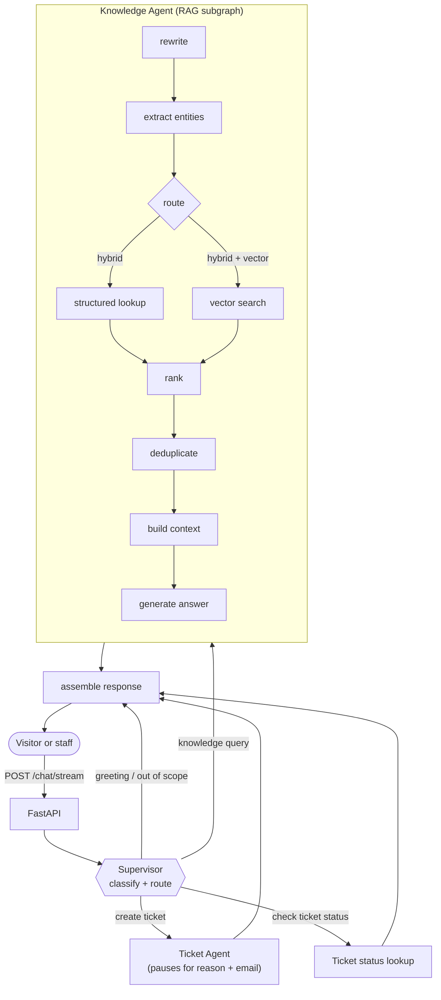
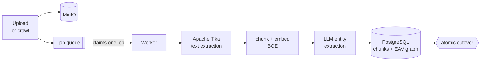

# AI Customer Assistant

A retrieval-augmented customer-support assistant that answers questions about a
company from that company's own documents — and cites where each answer came
from.

Visitors chat without an account. Staff sign in to teach the assistant new
material, browse what it knows, and administer the system.

```
Python 3.12  ·  FastAPI  ·  LangGraph  ·  PostgreSQL + pgvector  ·  MinIO  ·  Apache Tika
1040 tests passing  ·  0 failing
```

---

## Table of contents

- [What it does](#what-it-does)
- [How it works](#how-it-works)
- [Tech stack](#tech-stack)
- [Getting started](#getting-started)
- [Configuration](#configuration)
- [Usage](#usage)
  - [Chat](#chat)
  - [Ingesting documents](#ingesting-documents)
  - [Knowledge graph](#knowledge-graph)
  - [Accounts and roles](#accounts-and-roles)
  - [API reference](#api-reference)
- [Development](#development)
- [Project structure](#project-structure)
- [Known limitations](#known-limitations)
- [Troubleshooting](#troubleshooting)
- [Contributing](#contributing)
- [Documentation](#documentation)

---

## What it does

Point it at your documents — upload PDFs and Word files, or crawl your website
— and it answers questions about them in plain language, with citations.

**Two kinds of retrieval, used together.** Every document is both embedded for
semantic search *and* mined by an LLM into an entity–attribute–value knowledge
graph. A question like *"what services do you offer?"* names something the
graph knows, so both searches run at once and the answer draws on structured
facts and prose together. A question that names nothing in particular falls
back to semantic search alone.

**Answers are grounded or refused.** The model only sees retrieved context,
and every reply carries the sources behind it. When retrieval finds nothing,
the assistant says it does not know rather than inventing an answer.

**It can open support tickets.** When someone asks for a human, the assistant
collects a reason and an email address across turns and files a ticket — a
multi-turn flow that survives page reloads because the conversation lives in
the database, not the browser.

### Features

| | |
|---|---|
| **Public chat** | No account needed. Suggested openers, streamed progress, source citations |
| **Hybrid retrieval** | pgvector semantic search + an EAV knowledge graph, fanned out in parallel |
| **Document ingestion** | PDF, DOCX and Markdown upload; single-page and whole-site crawling |
| **Website crawling** | Sitemap-first discovery with a link-following fallback, rendered by Playwright, reviewed before anything is ingested |
| **Knowledge graph explorer** | Interactive 2D/3D force-directed view of everything the assistant knows |
| **Support tickets** | Multi-turn creation with email validation, plus status lookup |
| **Versioned corpus** | Re-ingesting a document supersedes the old version atomically; superseded facts are kept and marked, never deleted |
| **Authentication** | JWT with rotating refresh tokens, Argon2id password hashing, three roles |
| **Admin surface** | Sources, jobs, statistics, tickets, and per-provider LLM API keys |

---

## How it works

### Request flow



The Supervisor classifies each message into one category and one intent, then
routes it. Only knowledge queries reach retrieval. Conversation history is
never sent by the client — it lives behind a PostgreSQL checkpointer keyed by
`thread_id`, which is also what lets the ticket flow pause mid-conversation
and resume later.

### Ingestion flow



Ingestion never runs inside the web process. An upload or crawl stores the
bytes in MinIO, writes a job row, and returns `202` immediately. A separate
worker claims jobs with `FOR UPDATE SKIP LOCKED` and runs the pipeline as a
sequence of composable stages, each of which can fail without corrupting the
corpus — the new version only becomes live at the final cutover.

Failures are classified rather than lumped together: transient ones are
retried with backoff and an attempt count, deterministic ones dead-letter
immediately, and a worker killed mid-job is requeued without waiting out a
backoff it did not earn.

### Storage model

| Table group | Purpose |
|---|---|
| `knowledge_source`, `knowledge_source_version`, `embedding_chunk` | The corpus: sources, their immutable versions, and 768-dimension embeddings indexed with HNSW |
| `entity`, `attribute`, `value`, `relation`, `value_provenance` | The knowledge graph, plus which document version asserted each fact and when |
| `knowledge_injection_job`, `crawl_discovery` | The ingestion queue and pending crawl reviews |
| `app_user`, `refresh_token`, `rate_limit_bucket`, `llm_credential` | Accounts, sessions, throttling, encrypted provider keys |
| `ticket` | Support tickets |
| `checkpoints`, `checkpoint_blobs`, `checkpoint_writes` | LangGraph conversation state |

---

## Tech stack

| Layer | Choice |
|---|---|
| API | FastAPI, Uvicorn, Pydantic v2 |
| Orchestration | LangGraph (Supervisor graph + Knowledge subgraph), PostgreSQL checkpointer |
| Database | PostgreSQL 16 with pgvector, SQLAlchemy 2 async (psycopg3), Alembic |
| Embeddings | `BAAI/bge-base-en-v1.5` via sentence-transformers, 768 dimensions |
| LLM | Groq (default), Anthropic and Google Gemini also supported end to end |
| Object storage | MinIO (S3-compatible) |
| Text extraction | Apache Tika, plus trafilatura for crawled HTML |
| Crawling | Playwright (Chromium) |
| Auth | PyJWT (HS256), Argon2id |
| Frontend | Dependency-free vanilla JavaScript, hash router, no build step |
| Tests | pytest, pytest-asyncio |

---

## Getting started

### Prerequisites

| | |
|---|---|
| Docker + Docker Compose | Runs Postgres, MinIO, Tika, the API and the worker |
| Python 3.12 | Only to run the API or the tests on the host |
| [uv](https://docs.astral.sh/uv/) | Dependency management |
| An LLM API key | Groq by default — [console.groq.com/keys](https://console.groq.com/keys) |

Without a provider key the app still starts; the resolver falls back to a
deterministic stub that answers plausibly and cites nothing.

### Installation

```bash
git clone https://github.com/satishkhanal45/ai-customer-assistant.git
cd ai-customer-assistant

# 1. Configuration. Both files are gitignored; never commit a filled-in .env.
cp backend/.env.example backend/.env    # then add your GROQ_API_KEY
cp backend/.env.example .env            # docker compose reads APP_PORT from here

# 2. Set a signing secret. AUTH_SECRET has no default — the app refuses
#    to start without one, and rejects anything under 32 characters.
python -c "import secrets; print('AUTH_SECRET=' + secrets.token_urlsafe(48))" >> backend/.env

# 3. Start Postgres, MinIO, Tika, the API and the worker.
#    Migrations run automatically on every container start.
make up

# 4. Create the service account ingestion attributes documents to.
make user

# 5. Create the first admin account.
docker compose exec backend python scripts/create_user.py you@example.com --role admin

# 6. Open the app. It lands on the assistant; staff sign in from the header.
make frontend
```

The first `make up` builds the backend image and downloads the embedding model
(~400 MB), so expect a few minutes. Subsequent starts are fast.

### Everyday commands

```bash
make up          # start the whole stack
make down        # stop it
make logs        # tail the logs
make status      # container health
make test        # run the test suite
make psql        # a psql shell on the running database
make ingest      # crawl and ingest a URL (prompts)
make verify      # what is currently in the corpus
make clean       # stop and DESTROY the database volume
```

Run `make help` for the full list.

---

## Configuration

Two `.env` files, deliberately:

| File | Read by | Holds |
|---|---|---|
| `backend/.env` | the application | Every setting: credentials, model names, tuning |
| `.env` (repo root) | `docker compose` | Only `APP_PORT`, for the port mapping |

Both are gitignored. `backend/.env` holds live credentials and must never be
committed.

### Essential settings

| Variable | Default | Notes |
|---|---|---|
| `AUTH_SECRET` | *none* | **The only setting with no default.** The process refuses to start without it and rejects anything under 32 characters. Rotating it signs everyone out — which is the intended emergency response |
| `GROQ_API_KEY` | unset | Or `ANTHROPIC_API_KEY` / `GEMINI_API_KEY`. A key saved on the Admin › API Keys page shadows the environment variable |
| `APP_PORT` | 8000 | Host port for the API and frontend |

### Selected tuning

| Variable | Default | Notes |
|---|---|---|
| `KNOWLEDGE_AGENT_TOP_K` | 8 | Chunks retrieved per query. **4 is a measured floor** — 8, 6 and 4 all hold recall@k at 100% and MRR at 0.933 on the golden set, while 3 breaks it |
| `KNOWLEDGE_AGENT_SIMILARITY_THRESHOLD` | 0.50 | Absolute similarity floor. Measured, not guessed |
| `KNOWLEDGE_AGENT_RELATIVE_SCORE_MARGIN` | 0.12 | How far below the best hit a chunk may score and survive |
| `KNOWLEDGE_AGENT_LLM_PROVIDER` | anthropic | Falls back to the first provider with a key, then the stub |
| `KNOWLEDGE_AGENT_REWRITE_MODEL_NAME` | *provider default* | The model for the rewrite and extraction calls. Only honoured when `LLM_PROVIDER` names the provider that actually resolves |
| `TURN_BUDGET_S` | 52 | Hard ceiling on one chat turn; part of an enforced timeout ladder |
| `CHAT_GLOBAL_PER_DAY` | 400 | Deployment-wide chat ceiling. Chat is public, so per-caller limits alone do not bound the provider bill |
| `CRAWL_DOMAIN_ALLOWLIST` | empty | Restrict crawling to these domains. Empty means any publicly routable host |
| `TRUST_PROXY_HEADERS` | false | Read `X-Forwarded-For` for rate-limit keys. Only enable behind a proxy that sets it |
| `LOG_PII` | off | Un-redacted node traces. **Never enable in a deployed process** |

Every setting has a working default except `AUTH_SECRET`. The complete
reference — the timeout ladder, retrieval thresholds, authentication, crawler
safety, logging and the database pool — is in [`status.md`](status.md)
§9, and each default's reasoning lives in the module that owns it.

### Rate limits

5 logins per 15 minutes (per address *and* per account), 20 chat turns a
minute and 500 a day per caller, 10 ingestion calls a minute, plus
`CHAT_GLOBAL_PER_DAY` across the whole deployment. Anonymous chat is keyed by
client IP; a signed-in caller by user id. `RATE_LIMIT_DISABLED=true` switches
all of it off for local development — it also disables login brute-force
protection, so it must never be set in a deployed process.

---

## Usage

The examples below assume `APP_PORT` is exported from `./.env`. Chat is public;
everything else needs a token, so get one first:

```bash
export APP_PORT=8000

TOKEN=$(curl -s -X POST localhost:$APP_PORT/auth/login \
  -H 'Content-Type: application/json' \
  -d '{"email":"you@example.com","password":"…","transport":"bearer"}' \
  | python -c 'import json,sys; print(json.load(sys.stdin)["access_token"])')
```

The browser needs none of this — it gets `HttpOnly` cookies and refreshes them
automatically. The bearer transport exists for scripts.

### Chat

| Endpoint | Shape |
|---|---|
| `POST /chat/stream` | Server-sent events: a `trace_id`, then progress stages, heartbeats, and the answer. What the UI uses |
| `POST /chat` | One buffered JSON response. The fallback when streaming is unavailable |

Both take `{"thread_id": "...", "message": "..."}` and are **public**. History
is never sent by the caller — it lives server-side, keyed by `thread_id`.

```bash
curl -X POST http://127.0.0.1:$APP_PORT/chat \
  -H 'Content-Type: application/json' \
  -d '{"thread_id": "demo", "message": "What services do you offer?"}'
```

```json
{
  "thread_id": "demo",
  "reply": "Alpinist Studios offers MVP development, staff augmentation…",
  "trace_id": "d276d8c1-…",
  "citations": [{"source_name": "services", "page": null, "version_number": 1}]
}
```

The streaming endpoint emits `stage`, `heartbeat`, and a final `result` or
`error` event.

### Ingesting documents

Nothing can be answered until something is ingested. Every path below only
*enqueues* a job — the worker does the work, so watch `make logs` or poll
`GET /ingest/jobs/{job_id}`. All `/ingest/*` endpoints require a signed-in
`member`.

**Upload a file** (PDF, DOCX or Markdown):

```bash
curl -H "Authorization: Bearer $TOKEN" \
  -F 'file=@handbook.pdf' http://127.0.0.1:$APP_PORT/ingest/upload
```

**Crawl a single page:**

```bash
curl -X POST http://127.0.0.1:$APP_PORT/ingest/crawl \
  -H "Authorization: Bearer $TOKEN" -H 'Content-Type: application/json' \
  -d '{"url": "https://example.com/docs", "scope": "PAGE"}'
```

**Crawl a website** — always two steps, so nothing is ingested unreviewed:

```bash
# 1. Discover. Returns a discovery_id and the pages found.
curl -X POST http://127.0.0.1:$APP_PORT/ingest/crawl/discover \
  -H "Authorization: Bearer $TOKEN" -H 'Content-Type: application/json' \
  -d '{"root_url": "https://example.com"}'

# 2. Confirm. Crawls and ingests exactly that list.
curl -X POST http://127.0.0.1:$APP_PORT/ingest/crawl/{discovery_id}/confirm \
  -H "Authorization: Bearer $TOKEN" -H 'Content-Type: application/json' -d '{}'
```

Discoveries expire after 10 minutes. Site crawls need a Chromium binary that
`uv sync` does not install:

```bash
cd backend && uv run playwright install --with-deps chromium
```

`GET /ingest/sources` lists what is already in the corpus, split into uploaded
files and crawled URLs with their chunk counts. The Ingest page shows both
below the upload and crawl forms.

### Knowledge graph

`/graph/*` (signed-in `member`) exposes the EAV graph for browsing: entity
lookup, search by name or by value, neighbours, a bounded subgraph, and the
shortest path between two entities. The Graph page renders it as an
interactive 2D/3D force-directed view with degree-scaled nodes, folded
low-degree neighbourhoods and type filters.

### Accounts and roles

Chat needs no account. Everything else does.

| Role | Can |
|---|---|
| `visitor` | The assistant, and nothing else. Chat is public, so nothing creates these accounts today — the tier is the floor of the ordering |
| `member` | Chat, browse the knowledge graph, upload documents, run crawls, watch jobs, see what is ingested |
| `admin` | All of that, plus accounts, agent prompts, LLM provider keys, and the Admin dashboard |

Roles are ordered by rank rather than checked by name, so adding a tier below
an existing one needs no guard to be edited. There is no self-signup: the
first admin is created from the command line, and every account after that
through `POST /auth/users`.

```bash
docker compose exec backend python scripts/create_user.py sam@example.com --role member
docker compose exec backend python scripts/create_user.py sam@example.com --update
```

The password is prompted for, never passed as an argument — an argument ends
up in shell history and in `ps` output. Use `--password-stdin` in a
provisioning script.

Sessions rotate: a refresh token is single-use, and presenting one twice is
read as theft and revokes every session that user has. The frontend therefore
funnels all 401 retries through one shared in-flight refresh — four parallel
retries would otherwise present the same token four times and log the user
out.


### API reference

Every endpoint is one of: public, `member` (any signed-in colleague) or
`admin`. `tests/api/test_route_protection.py` enumerates the assembled app and
asserts exactly this table, so a route added later is protected by default or
the suite fails.

| Method | Path | Access | Purpose |
|---|---|---|---|
| `GET` | `/health` | public | Liveness |
| `POST` | `/chat` | public | One buffered turn |
| `POST` | `/chat/stream` | public | The same turn as server-sent events |
| `POST` | `/auth/login` | public | Issue tokens (cookie or bearer) |
| `POST` | `/auth/refresh` | public | Rotate the refresh token |
| `POST` | `/auth/logout` | member | Revoke the current session |
| `GET` | `/auth/me` | member | The signed-in account |
| `POST` | `/auth/users` | **admin** | Create an account |
| `POST` | `/ingest/upload` | member | Enqueue a file (PDF / DOCX / Markdown) |
| `POST` | `/ingest/crawl` | member | Enqueue a single page |
| `POST` | `/ingest/crawl/discover` | member | Discover a site's pages for review |
| `POST` | `/ingest/crawl/{id}/confirm` | member | Ingest the reviewed list |
| `GET` | `/ingest/jobs/{id}` | member | Job status, attempts and failure kind |
| `GET` | `/ingest/sources` | member | What is already ingested, files vs URLs |
| `GET` | `/graph/search` | member | Find entities by name |
| `GET` | `/graph/search_value` | member | Find entities by attribute value |
| `GET` | `/graph/entities/{id}` | member | One entity with its facts |
| `GET` | `/graph/entities/{id}/neighbors` | member | Adjacent entities and relations |
| `GET` | `/graph/subgraph` | member | A bounded fragment of the graph |
| `GET` | `/graph/path` | member | Shortest path between two entities |
| `GET` | `/admin/knowledge-sources` | **admin** | Every source and its versions |
| `GET` | `/admin/jobs` | **admin** | The ingestion queue |
| `GET` | `/admin/stats` | **admin** | Corpus and graph counts |
| `GET` | `/admin/tickets` | **admin** | Support tickets |
| `GET` | `/admin/llm-providers` | **admin** | Which providers are configured (last four characters only) |
| `PUT` | `/admin/llm-providers/{p}` | **admin** | Save a provider key |
| `DELETE` | `/admin/llm-providers/{p}` | **admin** | Clear a provider key |
| `POST` | `/admin/llm-providers/{p}/default` | **admin** | Choose the default provider |

Provider keys are **write-only**: no endpoint ever returns one, only its last
four characters. Stored keys are AES-GCM encrypted under a key derived from
`AUTH_SECRET`, so rotating that secret means re-entering them.

---

## Development

### Running the tests

```bash
make test                                  # whole suite
make test PYTEST_ARGS='-q tests/agents'    # one directory
```

**1040 passing, 13 skipped, no failures or errors.**

Use `make test` rather than a bare `pytest`: an activated conda environment
shadows the project's interpreter and produces spurious collection errors.
`make test` invokes `backend/.venv`'s Python by absolute path.

Tests that need a live Postgres, a Groq key, or a Chromium binary skip
themselves when those are absent, so a bare checkout still goes green.

### Running the API on the host

```bash
make uvicorn        # port 8002, with reload
```

Useful for tracebacks and reload-on-save. Note it reads `backend/.env`
directly, so a change there takes effect on restart without rebuilding.

### Measurement tooling

Two harnesses exist because the tuning in this project is measured rather
than guessed, and both should be re-run after changing the corpus, the
embedding model or the thresholds:

```bash
cd backend
set -a && . ./.env && set +a
POSTGRES_HOST=localhost POSTGRES_PORT=5433 \
  env -u PYTHONPATH ./.venv/bin/python scripts/calibrate_retrieval.py --detail
```

`scripts/calibrate_retrieval.py` measures retrieval against a golden set
(recall@k, MRR, mean chunks returned per margin). A live classification golden
set lives in `tests/agents/supervisor_agent_test/test_classification_golden.py`
and runs opt-in with a provider key set.

---

## Project structure

```
ai-customer-assistant/
├── backend/
│   ├── src/ai_customer_assistant/
│   │   ├── main.py              FastAPI bootstrap: lifespan, CORS, routers, static frontend
│   │   ├── timeouts.py          the enforced timeout ladder (refuses to start if inverted)
│   │   ├── llm_credentials.py   provider registry; encrypted keys with environment fallback
│   │   ├── agents/
│   │   │   ├── supervisor/      classification, routing, the top-level graph
│   │   │   ├── knowledge/       the RAG subgraph — rewrite, retrieve, rank, answer
│   │   │   └── ticket_agent/    ticket creation, persistence, email validation
│   │   ├── ingestion/
│   │   │   ├── crawler/         sitemap discovery, Playwright fetching, link parsing
│   │   │   ├── tika/            text extraction client
│   │   │   ├── chunk_embed/     chunking strategies, tokenizer, BGE embeddings
│   │   │   ├── extraction/      LLM entity/attribute/relation extraction
│   │   │   ├── queue/           PGQueue producer, worker loop, retry policy
│   │   │   ├── storage/         MinIO upload and the source repository
│   │   │   ├── graph/           knowledge-graph read queries
│   │   │   ├── pipeline.py      the Result-composed stage sequence
│   │   │   └── reconcile.py     one-time merge of pre-ontology duplicates
│   │   ├── ontology/            the vocabulary shared by ingestion and retrieval
│   │   ├── api/                 routers: chat, graph, ingest, admin
│   │   ├── auth/                tokens, passwords, roles, rate limiting, SSRF guard
│   │   ├── db/                  SQLAlchemy models, shared engine, checkpointer
│   │   └── services/            ChatService, shared embeddings
│   ├── alembic/versions/        16 migrations
│   ├── scripts/                 worker entry point, user creation, calibration
│   └── tests/                   75 test modules, mirroring the source layout
├── frontend/
│   ├── index.html               the shell
│   └── src/
│       ├── router.js            hash router and role guard
│       ├── api.js               fetch wrapper with single-flight token refresh
│       └── pages/               chat, graph, ingest, overview, login, admin, prompt, apikeys
├── docker-compose.yml           postgres, minio, tika, backend, worker
├── docs/                        original design documents and knowledge-base source material
├── Makefile                     the everyday commands
├── status.md                    detailed status, measurements, every fixed and open problem
└── CHANGELOG.md                 release-shaped history of every change
```

---

## Known limitations

**Two questions inside one minute will not both be fast on a free-tier LLM
quota.** One turn costs roughly 9,000 tokens across four LLM calls, against
Groq's free-tier 8,000 tokens per minute. An oversized request is not refused
— it waits for the token bucket to refill, and that wait *is* the latency.
Splitting the calls across two models (each has its own bucket) brings a
single question to about 5 seconds. Retrieval itself is ~0.2 s and is never
the bottleneck. See [`status.md`](status.md) for the measurements.

**The free-tier quota is shared between ingestion and chat.** A worker
draining a backlog will make the assistant report that it is handling more
requests than it can keep up with. Stop the worker when demonstrating the
chat.

**One residual gap in the SSRF guard, written down rather than papered
over.** The crawler validates a URL, resolves it, refuses anything not
publicly routable, and re-checks the address actually connected to — but it
cannot *pin* the connection to the address it validated, because `httpx` has
no supported way to do that without breaking certificate verification. An
authenticated caller can therefore still cause one *blind* request to an
internal address; they cannot see the response. `auth/ssrf.py` documents this
in full.

**The prompt editor is device-local.** Prompts can be viewed and edited in the
UI but there is no backend write endpoint yet, so changes do not persist or
propagate.

**An OpenAI key can be stored but nothing reads it.** There is no OpenAI
client on either the classification or the retrieval side.

---

## Troubleshooting

| Symptom | Cause and fix |
|---|---|
| `pytest` reports two dozen collection errors | An activated conda environment shadows the project interpreter. Use `make test`, which invokes `backend/.venv`'s Python by absolute path |
| The app will not start: *"AUTH_SECRET is not set"* | Deliberate. Generate one into `backend/.env` — step 2 of [Installation](#installation) |
| `401 Unauthorized` on `/ingest/*` or `/graph/*` | Those need a signed-in `member`. Get a token first — see the top of [Usage](#usage) |
| *"I'm handling more requests than I can keep up with"* | The LLM provider's per-minute token budget. On Groq's free tier one turn costs roughly 9,000 tokens against 8,000 per minute; wait about a minute, or see [Known limitations](#known-limitations) |
| The worker keeps running old code after a rebuild | The `worker` service has no `build:` section — it reuses the `backend` image. `docker compose build worker` reports *"No services to build"* and silently does nothing. Run `docker compose build backend`, then restart the worker |
| Crawler tests fail, or a site crawl does nothing | The Chromium binary is missing: `cd backend && uv run playwright install --with-deps chromium` |
| A chat answer says it does not know something you ingested | Check the job actually finished — `GET /ingest/jobs/{id}` or `make verify`. Ingestion is asynchronous, so `202` means *queued*, not *indexed* |
| Frontend edits do not appear | The frontend is bind-mounted and served with `Cache-Control: no-cache`, so a hard reload is normally enough. If you changed backend code, that is baked into the image — rebuild |

---

## Contributing

1. Branch from `main`.
2. Keep the suite green: `make test`.
3. Add a test that fails without your change. This codebase's recurring defect
   class is the *silent* one — a threshold that rejects good answers, a
   retrieval branch with no way out, a write discarded by a rollback — so the
   tests that earn their keep assert the **consequence**, not the status code.
4. Re-run the measurement harnesses if you touch retrieval, prompts or the
   corpus (see [Measurement tooling](#measurement-tooling)). Tuning in this
   project is measured, not guessed, and the numbers are recorded next to the
   defaults they justify.
5. Record anything substantial in [`status.md`](status.md) with the
   evidence behind it.

---

## Documentation

| File | What it is |
|---|---|
| [`status.md`](status.md) | **Start here.** What works, what does not, and every fixed and open problem with the measurement behind it. Read it before changing anything substantial |
| [`CHANGELOG.md`](CHANGELOG.md) | Release-shaped summary of the same work |
| [`ingestion.md`](ingestion.md) | The ingestion pipeline review and its follow-up items |
| [`authentication_implementation.md`](authentication_implementation.md) | The authentication design; §15 lists where the implementation ended up differing from the plan |
| [`test.md`](test.md) | A live end-to-end test through a real browser, and the nine defects it found |
| [`frontend/crawler_frontend_integration.md`](frontend/crawler_frontend_integration.md) | Every ingestion endpoint, verified against `api/ingest.py` |
| `docs/architecture.md`, `docs/agents_integration_plan*.md`, `docs/agent implementation and integration.md`, `frontend/frontend_plan.md` | **Historical.** The original design documents, each carrying a banner saying so. They describe what was intended, not what was built — several decisions were later made differently, and a few were reversed with evidence |
| `docs/pricing.md`, `docs/Alpinist Studios.pdf` | Not documentation — source content for the knowledge base |
