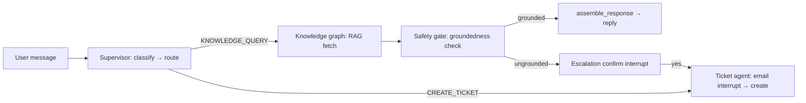

# Agent Implementation and Integration

Status: **All phases of the agent integration have been implemented.** This
document records what was built across the six phases, where each piece lives
in the codebase, how the pieces are wired together in the serving layer, and
exactly how to run and test the agents locally.

---

## 1. What has been implemented

The system is a multi-agent conversational assistant built on LangGraph. Four
agents are integrated into one compiled Supervisor graph:

| Agent | Package | Responsibility |
|---|---|---|
| **Supervisor** | `agents/supervisor/` | Intent classification, routing, post-downstream finalization |
| **Knowledge** | `agents/knowledge/` | Hybrid RAG: rewrite → extract → retrieve → rank → grounded answer |
| **Safety** | `agents/safety_agent/` | Groundedness check + escalation confirmation gate |
| **Ticket** | `agents/ticket_agent/` | Idempotent ticket creation backed by `TicketStore` |

### Phase 0 — Foundations & contracts
- `agents/contracts.py`: shared contract types — `ConversationTurn` (role +
  content), `DownstreamResult`, `DownstreamStatus`, and `flatten_history()`.
- `agents/supervisor/schema.py`: re-exports `ConversationTurn`, defines the
  `SupervisorState` LangGraph channel (plus `trace_id` for per-request
  correlation).
- `db/checkpointer.py`: durable checkpointer — Postgres
  (`AsyncPostgresSaver`) when `POSTGRES_*` is configured, else in-memory
  `MemorySaver` for dev/tests.
- Compiled graph accepts `None`-defaulted `knowledge_graph`, `ticket_ops`,
  `checkpointer`, etc., so phases could be landed incrementally.

### Phase 1 — Knowledge Agent integration
- `agents/knowledge/`: full hybrid RAG subgraph
  (rewrite → extract → structured/vector/hybrid retrieval → rank →
  deduplicate → build context/prompt → LLM answer), built by
  `graph.build_knowledge_agent_graph(...)` and compiled as a `StateGraph`.
- Retrieval nodes receive an **async `session_factory`** (not a shared
  session) so hybrid fan-out never shares one `AsyncSession` across
  coroutines.
- `agents/supervisor/agents_wiring.py`: `make_knowledge_agent_node(...)`
  adapts `SupervisorState` → Knowledge input and runs `knowledge_graph.ainvoke`
  under `asyncio.wait_for` (8s default). Timeout/error/missing-response all
  map to an `error` marker consumed by the Safety gate.

### Phase 2 — Safety gate
- `agents/safety_agent/groundedness.py`: per-sentence embedding similarity
  check (`check_groundedness(answer, retrieved_chunks, embedding_model)`) →
  `GroundednessResult`.
- `agents/supervisor/agents_wiring.py`: `make_safety_gate_node(...)` runs after
  the Knowledge node and maps the result into the canonical `DownstreamResult`
  — grounded → `report_grounded`, ungrounded → escalation-confirmation
  `interrupt()`. Upstream `error` markers short-circuit straight to
  `DownstreamStatus.ERROR`.
- `report.py` + `generate_fallback_response()` produce the typed reports and
  the escalation prompt text.

### Phase 3 — Post-downstream routing
- `agents/supervisor/graph.py` + `agents_wiring.py`: `decide_post_downstream`
  returned by a conditional edge after the Safety gate — FINALIZE →
  `assemble_response` → END, ESCALATE → re-entrant `ticket_agent`.

### Phase 4 — Ticket agent
- `agents/ticket_agent/store.py`: `TicketStore` — idempotency-keyed
  `create_ticket`, with an optional `next_sequence` id sink
  (`DocNumber`).
- `agents_wiring.py`: `make_ticket_agent_node(...)` opens the ticket
  via `interrupt()` (email collection) and creates a real, idempotent
  ticket on resume.

### Phase 5 — Serving layer
- `services/chat_service.py`: `build_chat_service(...)` constructs the whole
  stack exactly once — checkpointer, compiled Supervisor graph with wired
  knowledge/safety/ticket dependencies, and the LLM client. All endpoints go
  through `ChatService` and it is the *only* chat surface.
- `ChatService.handle_message(thread_id, user_message)`: conversation history
  is owned by the checkpointer (never sent by the caller); pending
  `interrupt()`s resume via `Command(resume=...)`.
- `main.py`: FastAPI bootstrap with lifespan managing the checkpointer
  (open/close). `api/routes.py`: chat route + `trace_id` generation.

### Phase 6 — Dependency implementation (final)
- `agents/knowledge/providers.py`: real Knowledge LLM providers — Anthropic,
  Groq, Gemini backends + deterministic stub, mirroring the Supervisor
  resolver (explicit arg → config → stub, including missing-credential
  degradation). `llm_completions(provider)` exposes the three callables
  (`rewrite/extraction/answer`).
- `services/embeddings.py`: shared BGE singleton — `build_shared_embeddings`
  loads **one** `SentenceTransformer` (module-level cache) and hands back both
  consumption faces: `embed_query` (Knowledge `vector_search`) and
  `embedding_model` (Safety's `check_groundedness`).
- `db/session.py`: async engine/factory (`get_async_engine`,
  `get_async_session_factory`, `get_async_session`) for the Knowledge agent's
  async retrieval nodes — keeps the sync `get_session` path intact.
- `services/chat_service.py`: `build_chat_service(...)` accepts
  `shared_embeddings` + an async `session_factory`; when both are given the
  real *compiled* Knowledge graph is constructed from provider completions and
  the shared `embed_query`, and the same instance is surfaced as
  `ChatService.embedding_model` for Safety's binding — never re-instantiated
  per request.

> **Supervisor LLM resolution (verified):** the Supervisor's classification
> client is already a real provider in the deployed wiring. `docker-compose`
> injects `backend/.env` (which contains `GROQ_API_KEY`) into the backend via
> `env_file: ./backend/.env`; `main.py` → `build_chat_service(...)` →
> `build_llm_client()` then resolves to `GroqSupervisorLLMClient` (verified:
> with the key injected, `build_llm_client()` returns the real Groq client,
> not the stub). Note: auto-selection only ever picks **groq** — Gemini
> requires an explicit `provider="gemini"` (no serving-layer default passes
> it). Starting `uvicorn main:app` on a bare shell without
> docker/exported keys will fall back to the deterministic stub, because only
> `cli.py` calls `load_dotenv()`.

---

## 2. Typical request flow (end to end)



A single turn may pause on `interrupt()` (escalation confirmation, email
collection); the reply text is the live prompt question, and the next message
resumes the graph via `Command(resume=...)`.

---

## 3. How to run

### 3.1 Full stack (docker-compose, Postgres + backend)

```bash
docker compose up --build
```

- `backend/.env` supplies PostgreSQL (`POSTGRES_*`), Minio
  (`MINIO_*`), and LLM keys (`GROQ_API_KEY` / `GEMINI_API_KEY`).
- `scripts/entrypoint.sh` waits for Postgres, runs `alembic upgrade head`,
  then `uvicorn main:app` on the configured `APP_PORT` (default 8000).
- Health check: `curl localhost:8000/health` → `{"status":"ok"}`.

### 3.2 Backend tests (no infrastructure required)

Run from `backend/` (uses the `[tool.pytest]` pythonpath):

```bash
uv sync                      # first time only
uv run pytest -q             # whole suite
uv run pytest tests/services -q           # serving layer
uv run pytest tests/agents -q             # all agent packages
uv run pytest tests/db -q                # checkpointer
uv run pytest tests/api -q              # HTTP routes
```

`testpaths = ["tests"]` in `pyproject.toml`; `pythonpath` includes
`src/ai_customer_assistant`, so tests import `agents.*`, `services.*`,
`db.*` directly. No Postgres or network is needed: the checkpointer falls
back to `MemorySaver`, knowledge providers to the deterministic stub, and
the embedding tests inject a fake BGE model.

### 3.3 One-off supervisor CLI (manual smoke)

```bash
cd backend
uv run python -m ai_customer_assistant.agents.supervisor.cli "Hi there"                 # stub, no keys
uv run python -m ai_customer_assistant.agents.supervisor.cli "Create a ticket" --provider groq --thread-id t1
uv run python -m ai_customer_assistant.agents.supervisor.cli "What's the policy?" --provider gemini
```

Uses `load_dotenv()` from the current dir; default provider is `groq` if
`GROQ_API_KEY` is set, else `stub`. Pass `--thread-id` to compile the graph
with a `MemorySaver` checkpointer so resume state persists for the process.

---

## 4. What each test area covers

| Test file | Coverage |
|---|---|
| `tests/contracts/test_contracts.py` | `DownstreamResult` validation, `ConversationTurn` role constraint, `flatten_history` |
| `tests/agents/supervisor_agent_test/test_supervisor.py` | Supervisor graph routing + end-to-end classify/route paths |
| `tests/agents/supervisor_agent_test/test_agents_wiring.py` | Knowledge → Safety → Ticket adapter handoffs (grounded, ungrounded, error) |
| `tests/agents/supervisor_agent_test/test_idempotency.py` | Duplicate `create_ticket` with the same key → one row |
| `tests/agents/knowledge/test_providers.py` | Provider resolution (explicit > config > stub), parseable stub output, `llm_completions` shape |
| `tests/agents/safety_agent/test_groundedness.py` | `check_groundedness` thresholds, edge cases (empty/whitespace answer, empty chunks) |
| `tests/agents/safety_agent/test_report_and_fallback.py` | `report.py` `DownstreamResult` construction + `generate_fallback_response` |
| `tests/agents/ticket_agent/test_ticket_agent.py` | Ticket store/agent idempotent create behavior |
| `tests/services/test_chat_service.py` | `build_chat_service` full-stack: history ownership, multi-turn resume |
| `tests/services/test_embeddings.py` | Shared BGE singleton identity (`embed_query` and `embedding_model` share one instance), normalized output, real graph assembly |
| `tests/services/test_interrupt_prompts.py` | Textual fidelity of the live interrupt prompt (escalation-confirmation + ticket email pause) |
| `tests/db/test_checkpointer.py` | Postgres/Memory checkpointer persistence |
| `tests/api/test_routes.py` | Chat endpoint + health over the app |
| `tests/chunk_embed/` | Tokenizer, chunking, embedding, pipeline, real-document fixtures |

`make_*_node(...)` factories keep every node unit-testable with fakes; the
integration tests confirm the wiring.

---

## 5. Configuration quick reference

| Setting | Where | Default |
|---|---|---|
| DB URL | `db/session.py::database_url()` | built from `POSTGRES_*` env |
| Async DB factory | `db/session.py::get_async_session_factory` | cached (`lru_cache`) |
| Knowledge config | `agents/knowledge/config.py` (`KnowledgeAgentConfig`) | env prefix `KNOWLEDGE_AGENT_` |
| Embedding model | `agents/knowledge/constants.py` | `DEFAULT_EMBEDDING_MODEL_NAME` = BAAI/bge-base-en-v1.5 |
| Shared embeddings | `services/embeddings.py::build_shared_embeddings` | module-cached; tests inject a fake model |
| Supervisor LLM | `agents/supervisor/llm_client.py` | `groq` if `GROQ_API_KEY` else `stub` |
| Knowledge LLM | `agents/knowledge/providers.py` | config `llm_provider` (anthropic) → stub w/o key |

---

## 6. Known limitations / next steps

- **Supervisor provider selection** auto-picks groq only; Gemini needs an
  explicit `provider=` at the CLI (no serving-layer path passes it).
- `uvicorn` run outside docker does not load `.env` automatically; export keys
  or run `--env-file` (`cli.py` is the only `load_dotenv()` caller).
- The Supervisor's real-time safety gate is currently driven by the Knowledge
  hint / safe-for-DB fail-soft path — wiring a per-request embedding-based
  check with genuinely retrieved chunks (both available behind the
  `chat_service` seam) is the possible follow-up if stricter grading is needed.