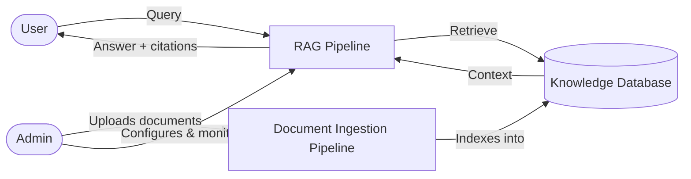

# Project Scope — AI Customer Assistant

Source: `supervisor_plan.md`. This document restates the MVP boundary in one place and gives a
single high-level picture of the system, deliberately kept to the components named for it —
detailed views of each box live in `architecture_diagrams.md`, `workflow_of_ingestion.md`,
`schema.md`, and `rag_plan.md`.

## In scope (Week 10 MVP lock)

* Conversational customer portal with knowledge-base Q&A, using the hybrid RAG pipeline
  defined in `rag_plan.md`.
* One complete business workflow end to end (e.g. checking the status of a support ticket or
  service request), including human escalation when required.
* Document ingestion for knowledge-base content (PDF, DOCX, Markdown), per
  `workflow_of_ingestion.md`.
* Admin capability to manage knowledge-base content and view ingestion/interaction status.

## Out of scope for MVP (stretch goals)

* Additional business workflows beyond the one selected (order management, appointment
  scheduling, account changes).
* Multiple simultaneous external integrations beyond the one required for the chosen workflow.
* Re-ranking, multi-hop retrieval, and query-rewriting beyond basic pronoun resolution
  (see `rag_plan.md` open items).
* Advanced analytics beyond basic AI performance metrics.

## High-level architecture

* **User** — the customer interacting through the Customer Portal.
* **RAG pipeline** — hybrid retrieval + generation, detailed in `rag_plan.md`.
* **Database** — PostgreSQL, holding both pgvector embeddings and the EAV structured store,
  per `schema.md`.
* **Document ingestion pipeline** — turns uploaded/synced documents into the searchable
  content the RAG pipeline retrieves from, per `workflow_of_ingestion.md`.
* **Admin** — uploads/manages source documents and configures the RAG pipeline (prompts,
  model, retrieval parameters) through the Admin Portal.

This diagram intentionally omits business-workflow execution, external integrations, and
notifications — those are part of the fuller container view in `architecture_diagrams.md`.
Let me know if any of those should be pulled into this scope-level picture instead.